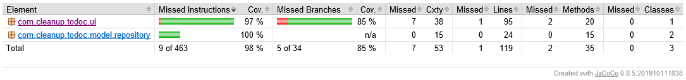

# Todoc

## P5 OCR - mini Android app for training - goal was to manage data persistency
(implemented Room, MVVM architecture, LiveData etc.)

### **Demo :**


## Installation

Import the project in **Android Studio** using the link below :

```bash
https://github.com/Jerome-eagle-OCR/Todoc-P5-OCR.git
```

## Run

In **Android Studio**, select "app" and hit "run" button or Maj+F10 on keyboard.

## Use

The app starts with no tasks.<br />
Click on the "+" button to add a new task.<br />
A **task** can only be added when it has a name entered and by default first project is selected.<br />
A **task** can be edited long clicking on it.<br />
A **task** can be deleted swiping it on the right.<br /><br />
**Note : projects, at the count of 3, are inserted automatically when database is created and cannot be modified, deleted or added, as asked.**

## Tests

Unit tests and UI tests have been done and are passed.<br />
Reports files can be found in repository root.

Code coverage done with jacoco (viewmodel and repositories), see hereunder the result :


